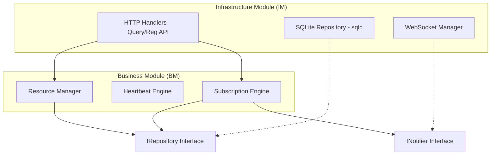

# NMOS Registry Architecture Plan

This document outlines the architectural design for an NMOS Registry implementing the IS-04 specification, following the **Module-Infrastructure-Module (MIM)** architecture.

## Overview

The NMOS Registry provides a centralized discovery and registration system for Networked Media Open Specifications (NMOS). It consists of two primary components:
1. **Registration API**: Handles resource lifecycle (CRUD) and heartbeating.
2. **Query API**: Handles resource discovery and real-time updates via WebSockets.

## Technology Stack

- **Language**: Golang
- **Database**: SQLite (in-memory)
- **Persistence**: `sqlc` (Type-safe SQL generator)
- **API**: Standard `net/http` with `go-chi/chi` for routing
- **Real-time**: `gorilla/websocket`

---

## MIM Architecture

The system is split into **Business Modules (BM)** and **Infrastructure Modules (IM)**, adhering to the principles of clean separation between NMOS logic and technical implementation.

### 1. Business Module (BM) - `internal/registry`

The Business Module contains the core logic of the NMOS Registry. It is independent of the database and transport layers, focusing on the rules defined in [IS-04](https://specs.amwa.tv/is-04).

#### Core Logic
- **Resource Management (IS-04 § APIs)**: Validates and processes registrations for Nodes, Devices, Sources, Flows, Senders, and Receivers.
- **Heartbeat Engine (IS-04 § Heartbeating)**: Manages Node health timestamps and identifies expired resources for garbage collection (default interval: 5 seconds).
- **Subscription Engine (IS-04 § Query API - Subscriptions)**: Manages Query API subscriptions and calculates updates for WebSocket clients based on resource changes.

#### Ports (Interfaces)
The BM defines interfaces that the IM must implement:
- `IRepository`: Methods for CRUD operations on NMOS resources and health timestamps.
- `INotifier`: Interface for sending real-time updates to subscribers.

### 2. Infrastructure Module (IM) - `internal/infrastructure`

The Infrastructure Module provides technical implementations for the interfaces defined in the BM.

#### Persistence (SQL/SQLite)
- **Implementation**: Uses `sqlc` to generate Go code from SQL schemas and queries.
- **Database**: In-memory SQLite (`:memory:`) ensures referential integrity (e.g., a Flow cannot exist without a Source as per [IS-04 § Node Structure](https://specs.amwa.tv/is-04/v1.3/docs/Node_Structure.html)).
- **Schema**: Defines tables for `nodes`, `devices`, `sources`, `flows`, `senders`, `receivers`, and `subscriptions`.

#### Transport (HTTP/WebSocket)
- **Routing**: Uses `go-chi/chi` to handle versioned NMOS paths (`/x-nmos/registration/{version}/` and `/x-nmos/query/{version}/`).
- **Registration API Handlers (IS-04 § Registration API)**: Implements `POST /resource`, `DELETE /resource`, and `POST /health/nodes/{nodeId}`.
- **Query API Handlers (IS-04 § Query API)**: Implements `GET /nodes`, `GET /sources`, etc., supporting RQL and pagination ([IS-04 § Query Parameters](https://specs.amwa.tv/is-04/v1.3/docs/Query_API_-_Query_Parameters.html)).
- **WebSocket Manager (IS-04 § Query API - WebSockets)**: Implements the `ws://` endpoint for real-time notifications, depending on the BM's `SubscriptionEngine`.

---

## Component Diagram



---

## Data Model (SQL)

The following schema will be used with `sqlc`:

```sql
CREATE TABLE nodes (
    id TEXT PRIMARY KEY,
    version TEXT NOT NULL,
    label TEXT NOT NULL,
    description TEXT NOT NULL,
    tags JSON,
    api JSON NOT NULL,
    caps JSON,
    services JSON,
    clocks JSON,
    interfaces JSON,
    last_seen TIMESTAMP DEFAULT CURRENT_TIMESTAMP
);

CREATE TABLE devices (
    id TEXT PRIMARY KEY,
    node_id TEXT NOT NULL REFERENCES nodes(id) ON DELETE CASCADE,
    -- ... other fields
);

-- Similarly for sources, flows, senders, receivers.
```

## Testing Strategy: Adaptive Testing

We will use **Sociable Unit Tests** to test the entire Business Module as a single unit.

- **Fakes**: We will implement an `InMemoryRepository` fake in the test suite to verify the BM's logic without needing a real SQLite instance for every test.
- **Verification**: Tests will focus on the public API of the `ResourceManager` and `HeartbeatEngine`, ensuring that registering a Node correctly updates the state and that missed heartbeats trigger resource removal.

## Implementation Phases

1. **Phase 1: Domain & Persistence**: Define the SQL schema, generate `sqlc` code, and implement the BM logic for resource registration.
2. **Phase 2: Registration API**: Implement the HTTP handlers for the Registration API and basic heartbeating.
3. **Phase 3: Query API**: Implement the read-only Query API endpoints with basic filtering.
4. **Phase 4: Subscriptions & WebSockets**: Implement the subscription logic and WebSocket notifications.
5. **Phase 5: Garbage Collection**: Implement a background worker to prune expired resources based on heartbeats.
